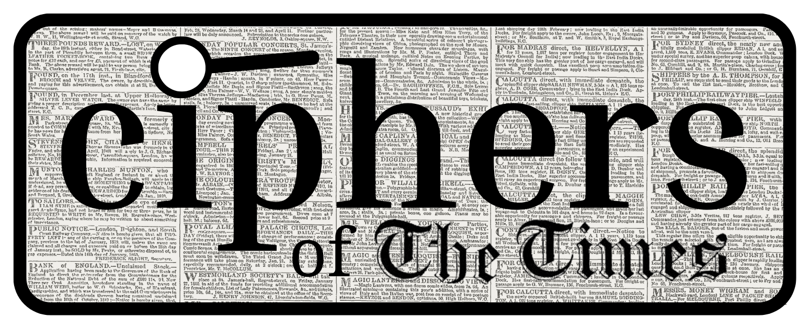

 

# Ciphers of _The Times_ - Computational Analysis of Newspapers and Newspaper Novels from 19th-century Britian

Ciphers of _The Times_ is a research project housed in McGill University Library 
which uses computational text analysis to explore the 
Agony Columns of _The Times_ and related fictional novels 
from the period.

This GitHub repository contains the code and data used throughout 
the project, and serves as the basis for an exhibition 
on the subject at the McGill University Library.

Most of this project consists of jupyter notebooks and .py files running a 
Python 3 kernel, but includes some analysis and 
visualization in R as well as the Shiny App that hosts the visualizations. 
The classification model was also conducted in R.
Initial data input and preprocessing was conducted with the pandas 
library. Our TTR and MATTR analysis employs the lexicalrichness library, 
while part of speech (POS) tagging was run using the spacy library. 
Initial visualizations draw on the matplotlib library, 
and our topic model uses the nltk for bigrams and trigrams, 
then employing the gensim ldamodel for output.

## Usage/Examples

Although anyone is more than welcome to use the notebooks 
and scripts used throughout the project,
perhaps of most interest would be to examine the output
data we have collected over the past year.
This includes metadata for nearly 220 Victorian novels,
as well as other information such as TTR, MATTR, raw statistics,
POS tagging, and topic modeling results. Both the processed and raw newspaper 
is available for downlaod as well as the full text of all 220 novels.

All output data frames are saved in the "spreadsheets" folder,
which includes complete data frames for the two novel corpora
used (one from .txtLAB, one we collected ourselves), as well as
data frames diving into specific period novels, to examine formal
variations throughout the novels, such as changes to dialogue/narration
ratios and significant differences in the use of verbs, nouns, pronouns,
and proper nouns. 

Visualizations are forthcoming for both axes of analysis, the Victorian novels
and the Victorian newspapers, to be presented as an exhibition
at McGill University Library in 2023. 

## Repo Authors

- [Ronny Litvack-Katzman](https://github.com/ronny-lk)
- Leehu Ben Sigler
- Lillian Simons

## Project Members

- Principal Investigator: Professor Nathalie Cooke
- Project Coordinator and Lead R: Ronny Litvack-Katzman
- Lead Python: Leehu Sigler
- Research Assistant (Data Analysis): Lillian Simons
- Research Assistant (Researcher, Narrative Design): Rosalia Poplawski
- Research Assistant (Researcher, Graphic Design): Bianca Tri

## Acknowledgements

Archival image files of _The Times_ were sourced through [_The Times_ Digital Archive](https://www.gale.com/intl/c/the-times-digital-archive), a Gale-Cengage resource. Optical character recognition (OCR), a process of image-to-text conversion used for newspaper pre-processing, was completed using [Transkribus](https://readcoop.eu/transkribus/) and with generous support from READ-COOP. We would like to offer thanks to [Gallica](https://gallica.bnf.fr/) (Jean-Philippe Moreux) for consulting on data extraction. Data on the Victorian novels was sourced from Project Gutenberg, txtlab's [NOVEL450](https://txtlab.org/data-sets/) data set, and [HUM19UK](https://www.linguisticsathuddersfield.com/hum19uk-corpus). 
 
 *** This project is funded by the Social Sciences and Humanities Research Council of Canada.
